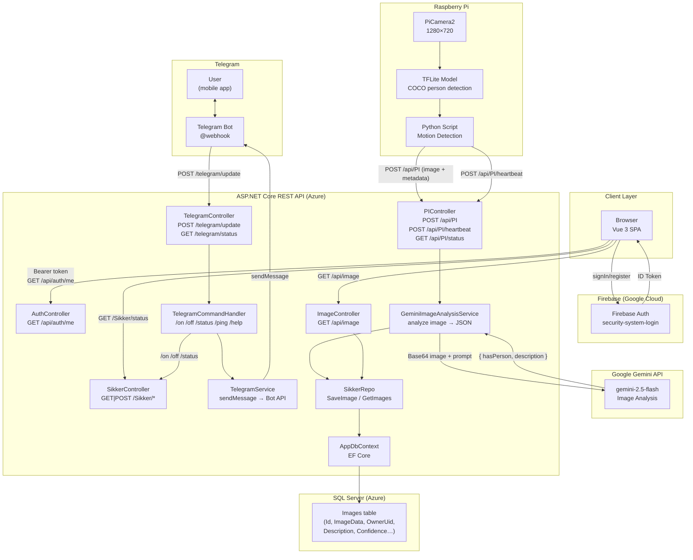

# 3.Semester Projekt - Sikkerhedssystem

Dette er et simplet sikkerhedssystem, som registre bevægelse og sender billedet til brugern.
---

## Table of Contents

- [About](#about)
- [Built With](#built-with)
- [Getting Started](#getting-started)
- [Usage](#usage)
- [Deployment](#deployment)
- [Contributing](#contributing)
- [Contributors](#contributors)
- [License](#license)

---

## About

<!-- A more detailed explanation of the project. What problem does it solve? What is the context? -->
Projektet har til formål at udvikle et simpelt, men effektivt, smart sikkerhedssystem ved hjælp af en Raspberry Pi. Systemet registrerer bevægelse, tager et billede og sender det øjeblikkeligt til brugeren. Den langsigtede vision er at understøtte ansigtsgenkendelse for at kunne skelne mellem husstandsmedlemmer og ukendte personer samt at gemme de optagne billeder sikkert i skyen.
Målet er et pålideligt system med lav vedligeholdelse, der øger hjemme sikkerheden uden behov for konstant overvågning.

---

## System Architecture



---

## Built With

- [Vue.js](https://vuejs.org)
- [Axios](https://axios-http.com)
- [REST API](https://restfulapi.net)
- [Azure Web Apps](https://azure.microsoft.com/en-us/products/app-service/web)
- [Azure Database](https://azure.microsoft.com/en-us/products/azure-sql/database)
- [GitHub Actions](https://github.com/features/actions)
- [GitHub Projects](https://docs.github.com/en/issues/planning-and-tracking-with-projects/learning-about-projects/about-projects)
- [Raspberry Pi](https://www.raspberrypi.com)
- [Postman](https://www.postman.com)
- [Swagger](https://swagger.io)
- [Visual Studio Code](https://code.visualstudio.com)

---

## Getting Started

### Prerequisites

- prerequisit 1
- prerequisit 2

### Installation

1. Clone the repository
   ```bash
   git clone https://github.com/TokeDit/3.-semester-Projekt-JABLST.git
   ```

2. Navigate to the project directory
   ```bash
   cd 3.-semester-Projekt-JABLST
   ```

---

## Usage

<!-- How do you run or use the project? Include examples, screenshots, or code snippets -->

```bash
# Example command to run the project
```

---

## Deployment

<!-- How is the project deployed? Describe the CI/CD pipeline, environments, and any special steps -->

This application is deployed as an Azure Web App via a CI/CD pipeline powered by GitHub Actions.
All changes must be submitted through a pull request targeting the `main` branch. Direct pushes
to `main` are restricted. Pull requests require review approval and must pass all required status
checks before merging. Upon merge, the pipeline automatically builds and deploys the application
to Azure.

---

## Contributing

<!-- How can others contribute? Link to a CONTRIBUTING.md if you have one -->

Contributions are welcome. Please follow the branching strategy outlined above and ensure all
code has been tested locally before opening a pull request. For significant changes, consider
opening an issue first to discuss the proposed approach.

---

## Contributors

- [Jonas Lolk Knudsen](https://github.com/Jonaslk727)
- [Anders Hornbøll Godsk Rasmussen](https://github.com/Andershgras)
- [Toke Hønning Ditlevsen](https://github.com/TokeDit)
- [Hafiz Muhammad Bilal Sarwar](https://github.com/bilalsarwar2907)
- [Stefan Ansbjerg Selchou Hansen](https://github.com/HumongusLaser)
- [Lars Jørgen Vedelslund](https://github.com/Omniform)

---

## License

This project is licensed under the [MIT License](LICENSE).

---

*For infrastructure or deployment issues, refer to the Azure Portal or contact the project maintainer.*
